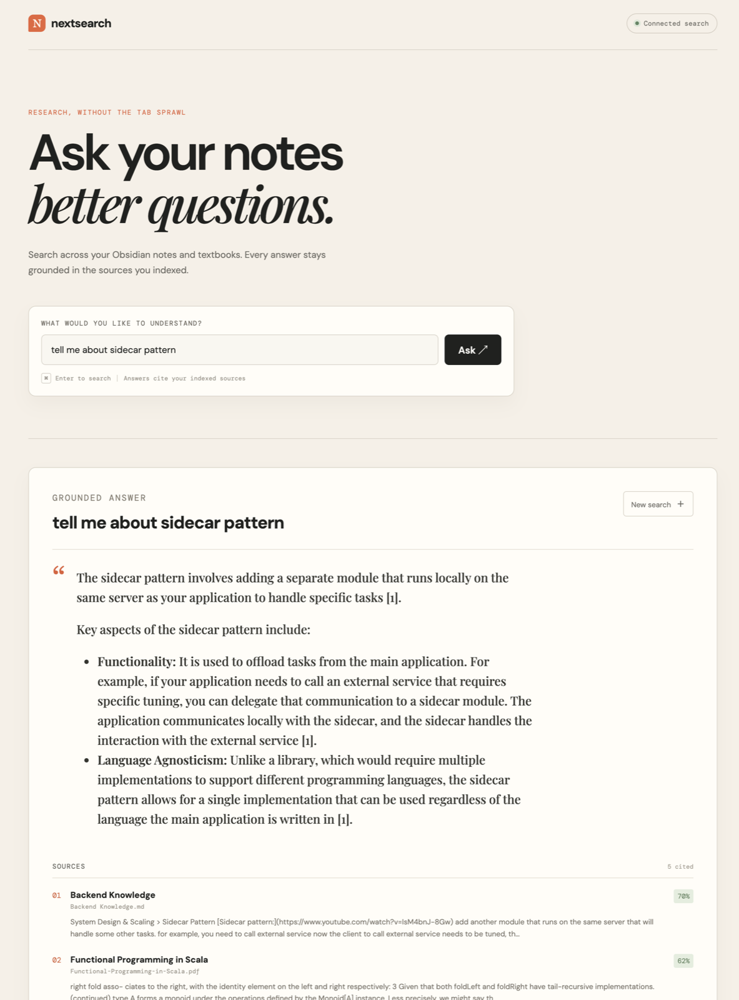

# nextsearch 🔍

A **RAG (Retrieval-Augmented Generation)** system built from scratch to let you query your **Obsidian notes** and **PDF textbooks** using natural language.

It ingests documents **incrementally** (only changed files are re-processed) and **streams** them one at a time to keep memory usage low.

## Web UI

Ask questions across your indexed notes and textbooks, then review grounded answers alongside their cited source passages.



## Stack

| Layer | Technology |
|---|---|
| **Parsing** | `pymupdf` (PDFs) · `python-frontmatter` (Markdown) |
| **Chunking** | Token-aware sliding window via `tiktoken` |
| **Embeddings** | Local `sentence-transformers` (default) · Google Gemini optional |
| **Vector Store** | ChromaDB (local, persistent) |
| **Generation** | Google Gemini 1.5 Pro |
| **CLI** | Typer + Rich |
| **Web UI** | Vue 3 + Vite (in `frontend/`) |

## Project Structure

```
nextsearch/
├── src/nextsearch/                 # Python RAG pipeline and CLI
├── data/                           # Local notes, PDFs, and vector store
├── tests/                          # Python pytest suite
├── scripts/                        # Standalone ingest/query runners
├── frontend/                       # Vue 3 + Vite question interface
│   ├── src/App.vue                 # Question, answer, citation, and state UI
│   ├── src/services/searchService.js # Backend adapter boundary
│   └── src/App.test.js             # Focused UI state tests
└── pyproject.toml
```

## Features

- **Section-aware Markdown chunking** — splits Obsidian notes at H1/H2/H3 boundaries and prepends a heading breadcrumb to every chunk.
- **Streaming ingestion** — processes one file at a time (parse → chunk → embed → store) so RAM stays flat even for large vaults.
- **Incremental ingestion** — SHA-256 file hashes skip unchanged files; deleted files have their chunks removed automatically.
- **Collision-safe chunk IDs** — chunk IDs include a hash of the full source path, so two files with the same name in different folders never clash.
- **Pluggable embeddings** — local `sentence-transformers` by default (no API quota); switch to Gemini with `EMBEDDING_PROVIDER=gemini`.

## Quick Start

### Python CLI

```bash
python -m venv .venv
source .venv/bin/activate
pip install -e ".[dev]"
cp .env.example .env
# Edit .env and add GOOGLE_API_KEY
nextsearch ingest
nextsearch ask "What is the attention mechanism in transformers?"
nextsearch stats
```

### Local web app

The Vue app uses the Python HTTP API through a Vite development proxy, so local development does not require CORS configuration. Start the API from the repository root in one terminal:

```bash
source .venv/bin/activate
uvicorn nextsearch.api.app:app --host 127.0.0.1 --port 8000
```

Start the frontend in another terminal:

```bash
cd frontend
npm install
npm run dev
```

The frontend requests `POST /api/ask` on the Vite origin; Vite forwards `/api/*` to `http://127.0.0.1:8000` by default. Override the target by setting `VITE_API_PROXY_TARGET` before running Vite. No API base URL is needed in the browser.

For a production build and focused UI tests:

```bash
cd frontend
npm run build
npm test
```

The app calls the configured backend by default. Backend/network/HTTP errors are shown as errors; they never silently fall back to sample content. To explicitly preview the static demo instead, set `VITE_DEMO_MODE=true` for the Vite process (for example, `VITE_DEMO_MODE=true npm run dev`). The header identifies demo preview mode.

## HTTP API contract

`frontend/src/services/searchService.js` is the UI-to-backend adapter. The Python API is `nextsearch.api.app:app`:

```http
POST /api/ask
Content-Type: application/json

{"query": "How does attention work?", "top_k": 5}
```

Successful response:

```json
{
  "answer": "A grounded answer...",
  "citations": [
    {
      "id": "stable-chunk-id",
      "title": "Attention Is All You Need",
      "source": "transformers/attention.md",
      "excerpt": "Relevant source passage...",
      "score": 0.94
    }
  ]
}
```

The backend derives the answer and citations from the same retrieved `SearchResult` objects. It validates non-empty queries and positive `top_k`; internal provider errors return a generic HTTP 500 message. No stats endpoint is currently implemented.

The API is additive: it wraps `RAGPipeline.ask_with_sources()` and does not change the CLI commands or their output contract.

### Other CLI commands

```bash
nextsearch ask                         # interactive mode
nextsearch ask "Explain backpropagation" --verbose
nextsearch stats                       # show vector store size
nextsearch reset                       # wipe all indexed data (CLI only)
```

## Running Python tests

```bash
pytest tests/ -v
```

## Extending the Stack

The `VectorStore` base class (`src/nextsearch/vector_store/base.py`) defines a minimal interface. The HTTP API is an additive wrapper around the existing pipeline; `nextsearch` CLI commands remain available independently.
